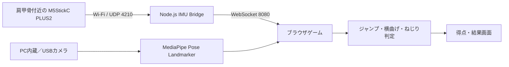

# Radio Calisthenics Heroes

「ラジオ体操ヒーローズ」の試作ゲームです。

Webカメラと MediaPipe Pose Landmarker を使って全身の姿勢を推定し、
プレイヤーがジャンプして着地すると足元の敵を踏み潰し、
上体を横へ曲げると左右から来る障害物を避けます。

## 現在実装している機能

- トップ画面で「MediaPipeのみ」と「センサーあり」を選べるプレイモード選択
- M5StickC PLUS2のIMUデータを、ローカルのWebSocket Bridge経由で受信・表示
- IMUの接続状態、端末IP、加速度、ジャイロ、受信数のリアルタイム表示
- Webカメラ映像からの骨格推定
- PC内蔵カメラとUSB接続カメラの検出・選択
- ゲーム前の3種目（体のねじり・両脚跳び・斜め下への曲げと胸反らし）
- 練習中のカメラ映像に重ねたMediaPipe骨格表示
- 種目ごとに切り替わるお手本人型アニメーション
- 肩幅・胴体長・脚長など、カメラ画面内での相対的な身体サイズの確認
- 練習時の跳び幅に合わせた個人別のジャンプ判定
- ジャンプ後の着地判定
- 足元に表示された敵を踏み潰す演出
- 両肩と両腰の位置を使った横曲げ判定
- 左右から接近する障害物と回避演出
- ボスのエネルギー弾と、上体のねじりによる反射判定
- センサーありモードでは、MediaPipeのねじり姿勢と肩甲骨付近のIMUジャイロを組み合わせた反射判定
- 3分間のバトルタイマーと、終了後のリザルト画面
- ボス戦の途中でも、その時点の結果を表示できる終了ボタン
- 結果表示から10秒後にカメラを終了してトップ画面へ自動復帰
- ジャンプ、着地、回避、警告、反射、画面切り替えなどの効果音
- 画面上部の効果音ON／OFF切り替え
- スコア、コンボ、ジャンプ量の表示

## 動かし方

カメラを使用するため、`index.html` を直接ダブルクリックするのではなく、
ローカルWebサーバーから開いてください。

Pythonがインストールされている場合は、このフォルダで次を実行します。

```bash
python -m http.server 4173
```

その後、Chromeで次のURLを開きます。

```text
http://localhost:4173
```

トップ画面でプレイモードを選び、開始ボタンを押してカメラの使用を許可してください。
頭から足先まで画面に入る位置に立つと、自動的に基準姿勢を取得します。

USBカメラを使う場合は、PCへ接続してからトップ画面の「カメラを探す」を押します。
表示された一覧からUSBカメラを選び、その後にゲームを開始してください。カメラ名が
表示されない場合は、一度カメラの使用を許可してから再度一覧を更新します。

「MediaPipeのみ」はWebカメラだけで判定します。「センサーあり」はWebカメラと
M5StickC PLUS2を併用します。ボス戦のねじり反射では、MediaPipeの姿勢とIMUの
ジャイロを組み合わせます。IMUが未接続でもMediaPipe判定でゲームを続行できます。

## M5StickC PLUS2を接続する

M5StickC PLUS2の電源を入れ、PCと同じWi-Fiへ接続してから、別のコマンドプロンプトで
次のコマンドを実行します。

```bat
cd radio-calisthenics-heroes\imu-bridge
npm install
node imu-bridge.cjs
```

`WebSocket: ws://127.0.0.1:8080` とIMUの受信ログが表示された状態でゲームを開き、
トップ画面の「センサーあり」を選びます。ゲーム画面の「IMU」が「受信中」になり、
加速度とジャイロの値が動けば接続成功です。Bridgeを停止するには、そのコマンド
プロンプトで `Ctrl + C` を押します。

公開版を開いた場合もBridgeはプレイヤー自身のPC上で動かす必要があります。
ブラウザのセキュリティ設定によってローカルWebSocketが遮断される場合があるため、
最初の動作確認には `http://localhost:4173` のローカル版を使用してください。

## 遊び方

1. カメラに全身を映します。
2. 静止して、カメラ上の身体サイズと基準姿勢を測定します。
3. 画面の案内に従い、体のねじり、両脚跳び、斜め下への曲げと胸反らしを行います。
4. 測定結果を確認して「バトル開始」を押します。
5. その場でジャンプし、着地して足元の敵を踏み潰します。
6. 障害物が左から来たら右へ、右から来たら左へ上体を曲げます。
7. ボスのエネルギー弾が近づいたら、脚を動かさず上体をねじって跳ね返します。
8. バトル開始から3分後に、得点・撃破・回避・反射の結果が表示されます。途中で「ここまでの結果を見る」を押すこともできます。
9. 結果画面は10秒後に自動でトップ画面へ戻ります。

## 動作判定

### ジャンプ

静止中に測定した腰と足首の高さを基準にし、練習で測った跳び幅から
プレイヤー別のしきい値を設定します。腰と足首が両方とも
一定以上上昇した後、腰が基準の高さへ戻ると着地成功と判定します。

使用するランドマークは左右の腰（23、24）と左右の足首（27、28）です。

```text
腰の上昇量   = 基準腰Y − 現在腰Y
足首の上昇量 = 基準足首Y − 現在足首Y
```

画面のY座標は下方向ほど大きいため、ジャンプすると上昇量が正になります。練習で測った
最大ジャンプ量の55%を腰の判定値にし、0.035～0.070の範囲に収めます。腰と足首の
両方が上昇した後、腰が基準位置から0.022以内へ戻ると着地成功です。連続誤判定を防ぐ
ため、ジャンプ後には1.15秒のクールダウンを設けています。

### ヒーロースキャン

正面静止時の肩幅・胴体長・脚長を、画像の縦横に対する相対値として取得します。
ねじりは見かけの肩幅の変化、両脚跳びは腰と足首の上昇、斜め下への曲げは
肩の下降と手の横移動、胸反らしは上体が戻り両ひじが伸びたことを使って確認します。
単眼カメラだけでは実際の身長をcm単位で正確に測れないため、実寸は表示しません。

### 横曲げ

両肩の中心と両腰の中心を求め、その横方向のずれを肩幅で割ります。
この値がしきい値を超えると、上体を左または右へ曲げたと判定します。
肩幅で割ることで、カメラとの距離や体格による影響を小さくしています。

```text
横曲げ量 = (腰中心X − 肩中心X) ÷ 現在の肩幅
```

絶対値が0.30以上になると横曲げ成立です。障害物が左から来た場合は右曲げ、右から
来た場合は左曲げを要求します。障害物の開始直後の誤反応を避けるため1.05秒待って
判定を開始し、2.85秒以内に成立しなければ回避失敗とします。

### ねじり反射

正面を向いた基準姿勢と比べて、見かけの肩幅がどれだけ小さくなったかを求めます。
ゲーム前の練習で測ったねじり量からプレイヤー別のしきい値を設定し、
ボスの弾が接近中にしきい値を超えると反射成功と判定します。
横曲げとの誤判定を抑えるため、肩の中心と腰の中心の横ずれも同時に確認します。

「センサーあり」では、ゲーム前のねじり練習中にIMUのジャイロ合成値
`√(gx² + gy² + gz²)`の最大値を測り、静止時の揺れも考慮して個人別のしきい値を
設定します。ボス戦では、MediaPipeでねじり姿勢と横曲げしていないことを確認し、
同じタイミングでIMUがしきい値以上の回転速度を検出すると反射成功になります。
IMUデータが途切れた場合は、ゲームを止めずMediaPipeのみの判定へ切り替わります。

MediaPipe側は、正面時より肩幅が小さく見える割合をねじり量として使います。

```text
肩幅圧縮率 = 1 − 現在の肩幅 ÷ 基準肩幅
```

練習中の最大圧縮率の62%を個人別判定値とし、0.09～0.18の範囲に収めます。また、
肩中心と腰中心の横ずれを基準肩幅で割った値が0.27未満であることを確認し、横曲げを
ねじりと誤判定しないようにします。

IMU側では、ジャイロ3軸の合成値を使用するため、装着方向が多少変わっても動作します。

```text
ジャイロ合成値 = √(gx² + gy² + gz²)
平滑化値       = 前回値 × 0.68 + 現在値 × 0.32
```

練習中最大値の48%と「静止時平均 × 2.2 + 10」の大きい方を採用し、30～160°/sに
収めます。弾が出た時点で過去のIMU検出を破棄し、弾が出てから検出されたIMUの動きを
700ミリ秒保持します。攻撃開始550ミリ秒後から、MediaPipe姿勢とIMU検出の両方が
成立すれば反射成功です。2.95秒以内に成立しなければ失敗になります。

## システム構成



カメラ映像とMediaPipeはブラウザ内で処理します。M5StickC PLUS2はIMU値をUDPで
PCへ送り、`imu-bridge.cjs`がブラウザで受信できるWebSocketへ変換します。

## コード構成

| ファイル・フォルダ | 役割 |
|---|---|
| `index.html` | 画面、CSS、MediaPipe、ゲーム進行、各動作判定を含む本体 |
| `imu-bridge/imu-bridge.cjs` | UDP 4210番でIMUを受信し、WebSocket 8080番へ転送 |
| `imu-bridge/package.json` | Bridgeで使用する`ws`ライブラリなどの設定 |
| `imu-receiver.cjs` | IMUのUDP受信だけを確認するための初期テスト用プログラム |
| `assets/sounds/` | ジャンプ、着地、警告、反射などの効果音 |

### `index.html`内の主な処理

| 関数 | 内容 |
|---|---|
| `startGame()` | 選択した内蔵／USBカメラを開始し、MediaPipeを準備 |
| `refreshCameraList()` | PCに接続されているカメラを取得して選択肢へ表示 |
| `connectImuBridge()` | `ws://127.0.0.1:8080`へ接続 |
| `handleImuMessage()` | 加速度・ジャイロを受信し、平滑化と練習値の記録を実行 |
| `resetCalibration()` | 身体サイズと個人別判定値の測定を初期化 |
| `updateTraining()` | ねじり、両脚跳び、斜め下曲げ・胸反らしの練習を判定 |
| `updateJumpDetector()` | 腰と足首の上昇・着地を判定 |
| `updateBendDetector()` | 肩中心と腰中心のずれから横曲げ回避を判定 |
| `updateBossAttack()` | MediaPipeとIMUを組み合わせてねじり反射を判定 |
| `finishBattle()` | 3分経過または途中終了時に結果を集計 |
| `returnToTop()` | カメラを停止してトップ画面へ戻す |

## IMU通信データ

M5StickC PLUS2からBridgeへ、次のようなJSONを送信します。

```json
{
  "n": 120,
  "ax": 0.21,
  "ay": -0.09,
  "az": 0.97,
  "gx": -0.4,
  "gy": 0.1,
  "gz": 0.2
}
```

`a`は加速度、`g`はジャイロ、末尾の`x`、`y`、`z`は各軸を表します。Bridgeは端末IPと
受信時刻を加え、接続中のブラウザへ同じデータを配信します。

## 判定のフォールバック

「センサーあり」を選んでも、IMUデータが1.5秒以上届かない場合はゲームを停止せず、
MediaPipeだけの判定へ切り替えます。IMU Bridgeが再接続されると、画面のIMU状態と
数値表示が再び更新されます。ねじり練習で有効なジャイロ値を取得できなかった場合も、
反射判定はMediaPipeのみで継続します。

## 公開版とローカル版

- 公開版：MediaPipeのみモードはブラウザだけで使用できます。
- センサーありモード：M5StickC PLUS2に加えて、プレイヤーのPC上でIMU Bridgeを起動する必要があります。
- ブラウザがHTTPSページからローカルWebSocketへの接続を遮断する場合は、ローカル版を使用してください。
- Vercelにはカメラ映像やIMU測定値を保存しません。

## 使用技術

- HTML / CSS / JavaScript
- MediaPipe Tasks Vision
- MediaPipe Pose Landmarker
- Web Camera API
- M5StickC PLUS2
- Node.js / UDP / WebSocket
- HTMLAudioElement

## 効果音の割り当て

- `jump.mp3`: ジャンプ開始
- `landing.mp3`: 敵を踏み潰した着地
- `obstacle-warning.mp3`: 障害物の接近
- `dodge-whoosh.mp3`: 横曲げ回避成功
- `boss-warning.mp3`: ボスのエネルギー弾
- `reflect.mp3`: ねじり反射成功
- `sword-draw.mp3`: ボス戦開始
- `data-display.mp3`: 練習の切り替えと結果表示
- `impact-text.mp3`: 攻撃演出と失敗
- `confirm-primary.mp3` / `confirm-secondary.mp3`: ボタン操作と練習成功

## 注意事項

- MediaPipeのプログラムと姿勢推定モデルを読み込むため、インターネット接続が必要です。
- 明るい場所で、カメラに全身が映るようにしてください。
- 安全のため、周囲に物がないことを確認して無理のない高さでジャンプしてください。
- カメラ映像はブラウザ内で処理し、このゲームでは保存しません。
